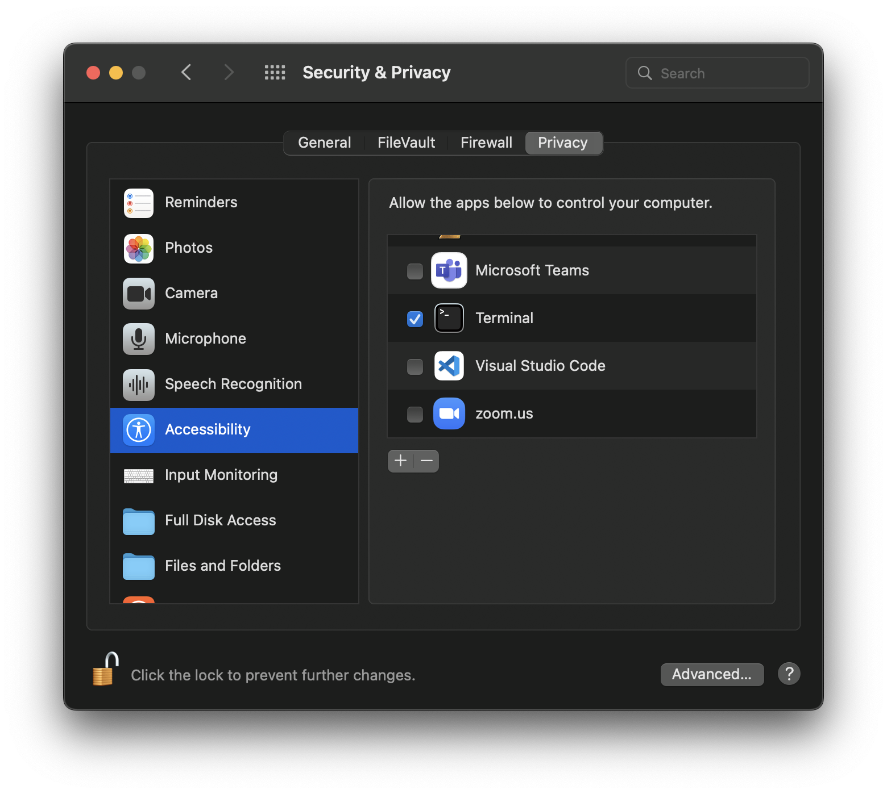

# Keep-awake (ka)
Keep-awake is a cli tool that can be used to keep your machine awake.

## Install

### Linux
```
brew install mdpadberg/tap/ka
```

### Windows   
```
scoop bucket add mdpadberg https://github.com/mdpadberg/scoop-bucket.git
scoop install ka
```

> :warning: Could be the case that you need to run your terminal in admin mode to make ka work

### macOS
```
brew install mdpadberg/tap/ka
```
Note:
Keep awake is a fully open-sourced project and will never collect any user data! However if you want to use the keyboard function, you need to enable Accessibility permissions. Add your default terminal you're using in the allowed Accessibility apps:


## Examples
```console
% ka -h
ka 0.7.0

USAGE:
    ka [SUBCOMMAND]

OPTIONS:
    -h, --help       Print help information
    -V, --version    Print version information

SUBCOMMANDS:
    help           Print this message or the help of the given subcommand(s)
    keyboard       Use keyboard to keep your machine awake (default tab & windows/super/command
    mouse          Use mouse to keep your machine awake
    programname    Set name for this program

```

### Subcommand: Mouse
Use mouse to keep your machine awake

```console
% ka mouse -h
USAGE:
    ka mouse [OPTIONS]

OPTIONS:
    -h, --help                   Print help information
        --height <height>        set your monitors height in pixels [default: 1080]
        --interval <interval>    set a time interval in seconds on how often you want to run this
                                 [default: 60]
        --width <width>          set your monitors width in pixels [default: 1920]
```

### Subcommand: Keyboard
Use keyboard to keep your machine awake [default tab & windows/super/command]

```console
% ka keyboard -h
USAGE:
    ka keyboard [OPTIONS]

OPTIONS:
    -h, --help                   Print help information
        --interval <interval>    set a time interval in seconds on how often you want to run this
                                 [default: 60]
```

### Subcommand: Programname
Set name for this program

```console
% ka programname -h
USAGE:
    ka programname <name>

ARGS:
    <name>    Set name for this program

OPTIONS:
    -h, --help    Print help information
```
